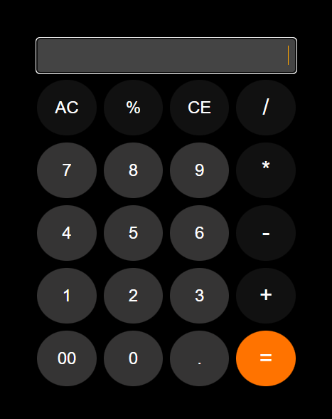

# OASIS INFOBYTE - Web Development and Designing

This repository contains a simple calculator web application developed as part of Level 2 Task 1 my OIBSIP internship program.

## Description

The calculator is a web-based application that allows users to perform basic arithmetic operations such as addition, subtraction, multiplication, and division. It also supports percentage calculations. The interface is designed with a dark theme for ease of use in various lighting conditions.

## Features

- Arithmetic operations: Addition (+), subtraction (-), multiplication (*), and division (/).
- Percentage calculation (%).
- Keyboard support for input.
- Dark theme UI for improved visibility.
- Responsive design for use on various devices.

## Usage
1. Open the `index.html` file in your web browser.
2. Use the mouse to click on the buttons corresponding to the numbers and operations you want to perform.
3. Alternatively, you can use your keyboard to input numbers and operators.
   - Use the number keys (0-9) for digits.
   - Use the following keys for operations: 
     - Addition: +
     - Subtraction: -
     - Multiplication: *
     - Division: /
     - Percentage: %
   - Press the Enter key to calculate the result.
   - Press the Backspace key to clear the last input.
4. The result will be displayed in the input field at the top.

## Screenshot



## Credits

This project was developed by `Dhanush S`. If you have any questions or suggestions, feel free to contact me.

   
## Installation

To use the calculator, simply clone the repository to your local machine:

```bash
git clone https://github.com/[your-username]/oibsip_taskno1_calculator.git
